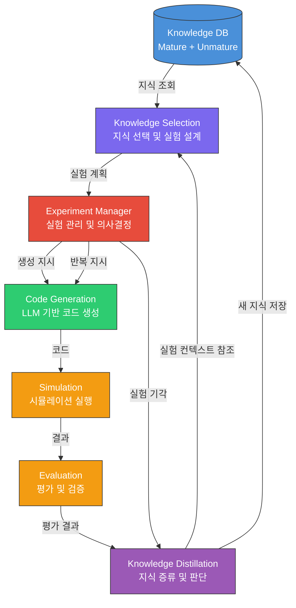
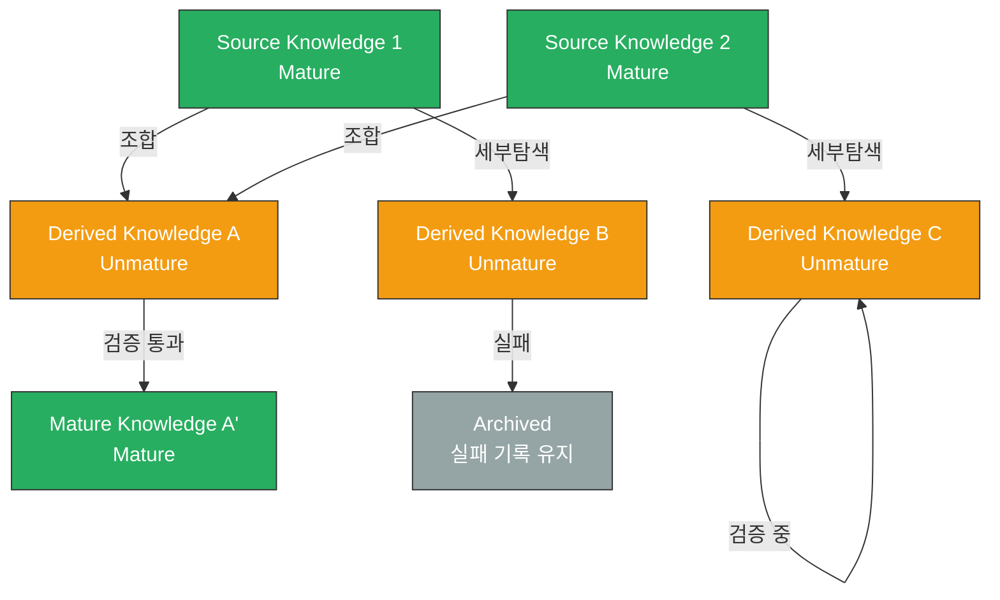

# HeuristiX: 자동 알고리즘/휴리스틱 발견을 위한 지식 진화 프레임워크

> **Version:** v1.0
> **Date:** 2026-03-26
> **Status:** Initial Idea Document

---

## 목차

1. [프로젝트 개요](#1-프로젝트-개요)
2. [시스템 아키텍처](#2-시스템-아키텍처)
3. [핵심 설계 질문 및 논의](#3-핵심-설계-질문-및-논의)
4. [참조 논문 비교 분석](#4-참조-논문-비교-분석)
5. [지식 성숙도 모델](#5-지식-성숙도-모델)
6. [TODO 분석 및 답변](#6-todo-분석-및-답변)
7. [차별화 포인트](#7-차별화-포인트)
8. [다음 단계 (Next Steps)](#8-다음-단계-next-steps)

---

## 1. 프로젝트 개요

### 1.1 핵심 아이디어

HeuristiX는 **지식 데이터베이스(Knowledge DB)를 중심으로 한 자동 알고리즘/휴리스틱 발견 프레임워크**이다. 기존의 LLM 기반 자동 휴리스틱 설계 연구들(FunSearch, EoH, AlphaEvolve, SeEvo)이 진화 과정에서 생성된 지식을 체계적으로 축적하고 재활용하는 메커니즘이 부족한 점에 착안하여, **지식의 선택(Selection), 생성(Generation), 증류(Distillation), 저장(Storage)을 하나의 순환 구조로 통합**하는 것이 핵심 아이디어이다.

### 1.2 프로젝트 목표

1. **지식 축적 기반의 점진적 발견**: 단순 반복이 아닌, 이전 실험에서 얻은 통찰을 체계적으로 축적하고 활용하여 더 효율적인 탐색을 수행
2. **실험 관리의 체계화**: Experiment Manager를 통해 실험의 기각, 반복, 지식 저장을 관리하여 p-value hacking 등의 문제를 방지
3. **모듈형 설계**: 각 모듈을 독립적으로 교체/개선할 수 있는 구조로, 빠른 실험과 프레임워크 변경이 가능
4. **지식 성숙도 관리**: 미성숙한 지식과 성숙한 지식을 구분하여 관리하고, 성숙한 지식의 신뢰성을 지속적으로 검증

### 1.3 기존 연구와의 핵심 차이

| 기존 연구 | 지식 관리 방식 | HeuristiX |
|-----------|--------------|-----------|
| FunSearch | Island 기반 Program Database (코드만 저장) | 통찰/메타지식까지 포함하는 Knowledge DB |
| EoH | Population 내 thought+code 쌍 유지 | 세대를 넘어 지식이 축적되는 영구 DB |
| AlphaEvolve | Program Database + MAP-Elites | 지식 성숙도 모델 + 관계형 지식 구조 |
| SeEvo | Collective Reflection Memory | 체계적 지식 증류 + 선택 전략 |
| ReasoningBank | 성공+실패 경험에서 추출한 reasoning strategy 메모리 | 알고리즘 설계 도메인에서의 체계적 지식 성숙도 관리 |

---

## 2. 시스템 아키텍처

### 2.1 전체 파이프라인



### 2.2 파이프라인 흐름 (텍스트 다이어그램)

```
┌─────────────────────────────────────────────────────────────────┐
│                        HeuristiX Pipeline                       │
│                                                                 │
│  ┌──────────┐    ┌──────────────┐    ┌──────────────────┐      │
│  │Knowledge │───>│  Knowledge   │───>│   Experiment     │      │
│  │   DB     │    │  Selection   │    │   Manager        │      │
│  │          │    │              │    │                  │      │
│  │ Mature   │    │ - 지식 조합   │    │ - Loop 반복     │      │
│  │ Unmature │    │ - 세부 탐색   │    │ - 실험 기각     │      │
│  │          │    │ - 실험 설계   │    │ - 지식 저장 지시 │      │
│  └────▲─────┘    └──────────────┘    └───────┬──────────┘      │
│       │                                       │                 │
│       │                                       ▼                 │
│  ┌────┴─────┐    ┌──────────────┐    ┌──────────────────┐      │
│  │Knowledge │<───│  Evaluation  │<───│ Code Generation  │      │
│  │Distill.  │    │  & Simulation│    │   (LLM)          │      │
│  │          │    │              │    │                  │      │
│  │ - 유의성  │    │ - 자동 평가   │    │ - 휴리스틱 생성  │      │
│  │ - 기각    │    │ - 다중 메트릭 │    │ - diff/전체코드  │      │
│  │ - 통찰 추출│    │ - 검증       │    │                  │      │
│  └──────────┘    └──────────────┘    └──────────────────┘      │
│                                                                 │
└─────────────────────────────────────────────────────────────────┘
```

### 2.3 모듈 상세 설명

#### 2.3.1 DB (Knowledge Database)

**역할**: 실험 결과와 실험에서 얻은 통찰을 저장하는 중앙 저장소

**저장 데이터 구조 (제안)**:

```
KnowledgeRecord {
    id: UUID
    type: "heuristic" | "insight" | "experiment_result" | "meta_knowledge"
    maturity: "unmature" | "mature"

    // 핵심 내용
    content: {
        thought: string          // 자연어 설명 (EoH의 thought 개념 확장)
        code: string             // 실행 가능한 코드
        evaluation_scores: dict  // 평가 메트릭
    }

    // 메타데이터
    keywords: list[string]       // 키워드 (관계 탐색용)
    source_knowledge_ids: list   // 이 지식이 파생된 원본 지식들
    experiment_history: list     // 이 지식을 생성하기까지의 실험 이력

    // 검증 정보
    validation_count: int        // 검증 횟수
    validation_contexts: list    // 어떤 맥락에서 검증되었는지
    confidence_score: float      // 신뢰도 점수

    // 시간 정보
    created_at: datetime
    last_validated: datetime
    maturity_promoted_at: datetime  // 성숙 지식으로 승격된 시점
}
```

**DB 구현 옵션 비교**:

| 옵션                     | 장점                                  | 단점             | 참조 논문                                  |
| ---------------------- | ----------------------------------- | -------------- | -------------------------------------- |
| Vector DB (유사도 기반)     | 의미적 유사 지식 검색 가능, 새로운 조합 발견에 유리      | 구조적 관계 표현 어려움  | SeEvo 미래 연구 방향 (Section VIII)          |
| 키워드 관계 그래프             | 지식 간 관계 명시적 표현, 탐색 경로 추적 가능         | 키워드 설계에 전문성 필요 | -                                      |
| 계층적 트리 구조              | Source Knowledge에서 가지처럼 뻗어나가는 탐색 표현 | 병렬적 지식 조합 어려움  | -                                      |
| 하이브리드 (Vector + Graph) | 유사도 검색 + 관계 추적 동시 가능                | 구현 복잡도 증가      | AlphaEvolve의 MAP-Elites + Island 조합 참조 |

**권장 접근**: **하이브리드 방식**을 권장한다. AlphaEvolve가 MAP-Elites와 Island 모델을 결합하여 탐색-활용 균형을 달성한 것처럼 (AlphaEvolve Section 2.5), Vector DB로 의미적 유사도를 활용하면서 키워드 기반 관계 그래프로 지식의 계보(lineage)를 추적하는 것이 가장 효과적일 것이다. ReasoningBank는 각 메모리 아이템을 `title` / `description` / `content` 세 필드로 구조화하고 `gemini-embedding-001`로 사전 계산된 임베딩을 별도 JSON에 저장하여 코사인 유사도 기반 검색을 수행하는데 (Section 4.2), 저장 단위가 "trajectory 전체"가 아니라 "추출된 전략 단위"라는 점은 HeuristiX의 `thought` 필드(insight 단위 저장) 설계와 직접 대응된다. 단 ReasoningBank는 임베딩 기반 유사도 검색을 구현하면서도 그래프 관계 추적은 미구현 상태로, 이 결합이 HeuristiX의 고유 기여 영역이 된다.

#### 2.3.2 Knowledge Selection (지식 선택)

**역할**: DB에서 현재 실험에 필요한 지식을 선택하고 실험을 설계

**핵심 기능**:
1. **지식 조합 전략**: 기존 지식을 결합하여 새로운 가설 생성
2. **세부 탐색 전략**: 기존 지식에서 더 깊이 들어가는 실험 설계
3. **실험 설계**: 선택된 지식 기반으로 구체적인 실험 계획 수립
4. **전체 실험 컨텍스트 관리**: 실험의 흐름과 맥락을 추적

**참조 논문에서의 대응 메커니즘**:

| 논문 | Knowledge Selection에 대응하는 메커니즘 | 상세 |
|------|----------------------------------------|------|
| FunSearch | Best-shot Prompting + Island Sampling | 각 island에서 높은 점수의 프로그램을 우선 샘플링하되, 클러스터 기반으로 다양성 유지 (Section 2.5-2.6) |
| EoH | 5가지 Prompt Strategy (E1, E2, M1, M2, M3) | 탐색(E1: 최대 차이 생성, E2: 공통 아이디어 변형)과 수정(M1: 성능 개선, M2: 파라미터 조정, M3: 단순화) 전략을 체계적으로 구분 (Section 3.4) |
| AlphaEvolve | Prompt Sampler + Meta Prompt Evolution | 이전 솔루션, 시스템 명령, 문제 컨텍스트, 평가 결과를 조합하고, LLM이 프롬프트 자체를 개선하는 메타 진화 (Section 2.2) |
| SeEvo | Reflection Operators (R_co, R_self, R_coll) | 개체 간 비교 반성, 자기 진화 반성, 집단 진화 반성을 통한 지식 선택 (Section IV.3) |
| ReasoningBank | Embedding 기반 유사도 검색 (top-k retrieval) | 현재 task query를 임베딩하여 메모리 풀에서 코사인 유사도로 top-k 항목 검색, 시스템 프롬프트에 주입 (Section 4.2). 기본 k=1이며, k가 늘어날수록 오히려 성능 저하 (노이즈 증가) — 품질이 수량보다 중요함을 시사 (Section 6.5) |

**설계 질문: Knowledge Selection이 전체 실험을 관리해야 하는가?**

원본 아이디어에서 제기된 이 질문에 대해, **Knowledge Selection이 전체 실험 컨텍스트를 관리하는 것이 적합하다**고 판단한다. 그 이유는:

1. **SeEvo의 Collective Reflection (R_coll)**: 모든 세대의 local reflection을 종합하여 장기 기억으로 유지하며, 이것이 이후 모든 진화 연산을 가이드한다 (SeEvo Equation 4). 이는 곧 "전체 실험 컨텍스트 관리"에 해당한다.
2. **AlphaEvolve의 Meta Prompt Evolution**: LLM이 프롬프트 자체를 개선하는 메타 진화를 별도의 데이터베이스에서 관리한다 (Section 2.2). 이는 실험 설계 자체를 학습하는 것이다.
3. **FunSearch의 Island Model**: 성능이 낮은 island를 주기적으로 폐기하고 재시작하는 전략은 전체 실험 방향을 관리하는 메커니즘이다 (Section 2.5).

따라서 Knowledge Selection 모듈이 하위 모듈(Code Generation, Simulation, Evaluation)의 파이프라인을 직접 관리하기보다는, **Experiment Manager와 협력하여 "무엇을 실험할 것인가"를 결정하고, Experiment Manager가 "어떻게 실험할 것인가"를 관리하는 역할 분리**가 바람직하다.

#### 2.3.3 Experiment Manager (실험 관리자)

**역할**: 실험의 실행, 반복, 기각을 관리하는 중앙 컨트롤러

**핵심 기능**:
1. **Loop 반복 관리**: 동일 실험의 반복 횟수와 조건 관리
2. **실험 기각 판단**: 유의미하지 않은 실험을 조기 종료
3. **지식 저장 지시**: Knowledge Distillation에 저장 명령 전달
4. **리소스 관리**: 계산 예산 배분 및 병렬 실행 관리

**참조 논문의 관련 메커니즘**:

- **AlphaEvolve의 Evaluation Cascade** (Section 2.4): 난이도가 증가하는 테스트 셋 앙상블을 통해, 초기 단계에서 유망하지 않은 솔루션을 빠르게 제거한다. 이는 Experiment Manager의 "실험 기각" 기능과 직접적으로 대응된다.
- **FunSearch의 Island 폐기** (Section 2.5): 4시간마다 하위 절반 island를 폐기하고 상위 island에서 재시작한다. 이는 비효율적인 실험 방향을 체계적으로 정리하는 것이다.
- **SeEvo의 Self-Evolution Reflection** (Section IV.3): `Delta_P <= 0`일 때 실패 분석을 수행하여 같은 실수를 반복하지 않도록 한다.

#### 2.3.4 Code Generation (코드 생성)

**역할**: LLM을 활용하여 휴리스틱/알고리즘 코드를 생성

**참조 논문별 코드 생성 방식**:

| 논문 | 생성 방식 | 출력 형태 | LLM | 특징 |
|------|----------|----------|-----|------|
| FunSearch | 단일 함수 진화 | 전체 함수 코드 | Codey (PaLM 2 기반) | 스켈레톤 + 핵심 함수만 진화, ~10-20줄 (Section 2.1-2.3) |
| EoH | Thought + Code 동시 생성 | 자연어 설명 + Python 함수 | GPT-3.5-turbo | 5가지 프롬프트 전략으로 다양한 생성 (Section 3.3-3.4) |
| AlphaEvolve | Diff 기반 코드 수정 | SEARCH/REPLACE 블록 | Gemini 2.0 Flash + Pro 앙상블 | 전체 코드베이스 진화 가능, 수백 줄 (Section 2.3) |
| SeEvo | Reflection 가이드 생성 | HDR 코드 조각 | GPT-4.1-mini, DeepSeek-V3, Qwen-Turbo | 반성 메커니즘이 생성을 가이드 (Section IV.2-IV.3) |

**HeuristiX를 위한 권장 접근**:

AlphaEvolve의 **Diff 기반 수정 + EoH의 Thought-Code 동시 생성**을 결합하는 것을 권장한다. 이유는:
1. Diff 기반 수정은 큰 코드베이스에서도 효율적이며, 변경 사항을 명확히 추적할 수 있다
2. Thought-Code 동시 생성은 EoH의 ablation study에서 코드만 진화시키는 것(C2C)보다 월등히 우수함이 입증되었다 (EoH Table 6: C2C 2.57% vs EoH 0.66%)
3. Knowledge DB에 thought(통찰)를 저장하여 재활용할 수 있다

#### 2.3.5 Simulation & Evaluation (시뮬레이션 및 평가)

**역할**: 생성된 코드를 실행하고 성능을 평가

**참조 논문별 평가 방식**:

| 논문 | 평가 방식 | 메트릭 | 특징 |
|------|----------|--------|------|
| FunSearch | 단일 메트릭 최적화 | 문제별 단일 점수 | evaluate 함수 반환값 (Section 2.4) |
| EoH | 인스턴스 세트 평가 | 평균 fitness | 여러 문제 인스턴스의 평균 성능 (Section 3.3) |
| AlphaEvolve | 다중 메트릭 + Cascade | 복수 스칼라 메트릭 | 다단계 평가 + LLM 피드백 평가 (Section 2.4) |
| SeEvo | Makespan + Tardiness | 복수 목적함수 | Teacher-Student + EMA 기반 동적 평가 (Section III.3) |

**HeuristiX를 위한 핵심 설계 요소**:

1. **다중 메트릭 평가**: AlphaEvolve처럼 복수의 평가 메트릭을 동시에 최적화한다. AlphaEvolve는 다중 메트릭이 단일 목표 메트릭의 성능도 향상시킨다는 것을 발견했다 (Section 2.4).
2. **Evaluation Cascade**: 간단한 테스트를 먼저 통과한 후에만 정밀한 평가를 수행하여 계산 비용을 절감한다.
3. **실험 횟수 반영**: 해당 결과를 도출하기까지 실행한 실험 횟수를 score에 반영하여 p-value hacking을 방지한다.

#### 2.3.6 Knowledge Distillation (지식 증류)

**역할**: 실험 결과에서 유의미한 지식을 추출하고, DB에 저장할 형태로 가공

**핵심 기능**:
1. **유의성 판단**: 실험 결과가 통계적으로 유의미한지 판단
2. **실험 결과 기각/수용**: 신뢰할 수 없는 결과를 걸러냄
3. **통찰 추출**: 코드/결과에서 메타 지식 추출 (FunSearch가 cap set에서 "reflection" 패턴을 발견한 것처럼)
4. **DB 저장 형식 결정**: Mature/Unmature 분류 및 키워드 태깅

**Knowledge Distillator는 Selector의 실험 설계를 알아야 하는가?**

원본 아이디어의 이 질문에 대해, **반드시 알아야 한다**. 그 이유는:

1. **SeEvo의 Self-Evolution Reflection**: 부모(parent)와 자식(offspring)을 비교하여 "무엇이 개선되었고 무엇이 실패했는지"를 분석한다 (Section IV.3, Equation 3). 이를 위해서는 어떤 실험이 수행되었는지의 맥락이 필수적이다.
2. **AlphaEvolve의 프롬프트 구성**: 이전 솔루션의 점수와 코드를 함께 프롬프트에 포함하여 "왜 이 솔루션이 좋은지/나쁜지"를 LLM이 파악할 수 있게 한다 (Section 2.2).
3. **맥락 없는 지식은 재현 불가**: 어떤 조건에서 실험이 수행되었는지 모르면, 지식의 일반화 가능성을 판단할 수 없다.

따라서 **Knowledge Distillator에 실험 컨텍스트(사용된 지식, 실험 설계, 평가 조건)를 전달하는 인터페이스**가 필요하다.

이 설계는 ReasoningBank가 실증한 방향과 일치한다. ReasoningBank는 3단계 증류 프로세스를 통해 (i) LLM-as-a-Judge로 성공/실패를 판단하고, (ii) 성공에서는 전략을 추출하며 실패에서는 "왜 실패했고 어떻게 예방할 수 있는가"를 반례 신호(counterfactual signal)로 변환한 뒤, (iii) 추출된 항목을 메모리 풀에 저장한다 (Section 4.2). 실패를 단순 폐기하는 기존 연구와 달리 실패 trajectory를 포함했을 때 +3.2% 성능 향상을 달성했다는 결과 (Section 6.1)는, HeuristiX에서 실패한 실험의 통찰을 Unmature 지식으로 보존하는 설계의 타당성을 직접 지지한다.

---

## 3. 핵심 설계 질문 및 논의

### 3.1 "DB를 쓰면 무조건 좋지 않을까? 기존 논문에서 DB를 쓰지 않은 이유는?"

**분석**: 기존 논문들도 사실상 DB를 사용하고 있다. 다만 그 형태와 복잡도가 다르다.

| 논문 | DB 형태 | 한계 |
|------|--------|------|
| FunSearch | Program Database (Island Model) | 코드와 점수만 저장. 통찰/메타지식 없음. 4시간마다 하위 island 폐기 (Section 2.5) |
| EoH | Population (N개 heuristic) | 세대 간 N개만 유지. 장기 기억 없음. 이전 세대의 탈락 개체 정보 소실 (Section 3.2) |
| AlphaEvolve | Program Database (MAP-Elites + Island) | 가장 발전된 형태이지만, 여전히 "프로그램+점수" 중심 (Section 2.5) |
| SeEvo | Collective Reflection Memory | R_coll이 장기 기억 역할을 하지만, 자연어 요약 형태로 구조화 부족 (Section IV.3) |
| ReasoningBank | Memory Pool (title/description/content) | 에이전트 trajectory에서 추출한 전략 단위 저장. 임베딩 기반 검색. 성숙도 모델 없이 단순 append (Section 4.2) |

**기존 논문이 "체계적 DB"를 쓰지 않은 이유 추정**:

1. **복잡도 증가**: DB 설계, 지식 표현 스키마, 검색 전략 등 추가 설계 필요
2. **실험 단위의 단순성**: 기존 연구들은 단일 문제(bin packing, TSP 등)에 집중하므로, 세대 내 population 관리만으로 충분
3. **연구 초기 단계**: FunSearch(2024), EoH(2024), AlphaEvolve(2025)는 "LLM+진화"의 가능성을 증명하는 데 초점. DB 최적화는 다음 단계의 연구 주제

**HeuristiX의 기회**: AlphaEvolve도 "Distillation opportunity"를 미래 방향으로 명시하고 있고 (Section 6), SeEvo도 "vector databases to match similar training instances"를 미래 연구로 제안한다 (Section V.4). ReasoningBank는 에이전트 인터랙션 도메인에서 전략 단위 메모리 DB를 실제로 구현하여 최대 20% 성능 향상을 달성했으며 (Section 5.2), 이는 알고리즘 설계 도메인에서 유사한 접근이 HeuristiX를 통해 가능함을 강하게 시사한다. 다만 ReasoningBank의 검색 수량 실험은 중요한 교훈을 남긴다: k=1이 최적이고 k가 늘수록 성능이 저하되는 현상 (Section 6.5)은 단순 append 방식에서 노이즈가 축적될수록 검색 품질이 떨어짐을 보여준다. HeuristiX의 Mature/Unmature 분류는 "Mature 지식을 우선 검색"하는 방식으로 이 문제를 지식 수준에서 근본적으로 해결하는 메커니즘이다.

### 3.2 "실험의 결과를 점점 좋게 만들면 p-value hacking이 일어나지 않을까?"

**위험성**: 매우 타당한 우려이다. 진화 과정에서 평가 메트릭에 과적합하는 것은 실제로 관찰된 문제이다.

**참조 논문에서의 관련 증거**:

- **EoH의 EoH-e1 과적합**: E1 전략만 사용한 EoH-e1은 훈련 용량(C=100)에 과적합하여, C=500 인스턴스에서 58.17%의 gap을 보였다 (EoH Table 5). 이는 단일 방향의 최적화가 과적합을 유발할 수 있음을 직접적으로 증명한다.
- **FunSearch의 일반화**: 훈련 인스턴스와 같은 크기의 OR1에서만 학습했지만 OR1-OR4까지 일반화되었다 (FunSearch Table 1). 다만 이는 bin packing 문제의 구조적 특성에 기인할 수 있다.
- **AlphaEvolve의 다중 메트릭**: 복수 메트릭 동시 최적화가 단일 메트릭 과적합을 방지한다고 명시적으로 언급한다 (Section 2.4).

**HeuristiX에서의 대응 전략**:

1. **다중 검증 메트릭**: AlphaEvolve처럼 복수의 독립적인 평가 메트릭 사용
2. **실험 횟수 페널티**: 결과를 도출하기까지의 실험 횟수를 score에 반영. 적은 시도로 좋은 결과를 낸 것에 더 높은 신뢰도 부여
3. **홀드아웃 검증**: 훈련에 사용하지 않은 별도의 검증 인스턴스 세트 유지
4. **통계적 유의성 검정**: 단순 점수 비교가 아닌 통계 검정 (예: Wilcoxon signed-rank test) 적용
5. **지식 성숙도 경로 추적**: 어떤 경로로 지식이 "성숙"했는지 기록하여, 편향된 경로를 감지

### 3.3 "실험이 흘러온 historical experiment를 알려줄 수 있으면 더 좋을까?"

**결론**: 매우 유용하며, 실제로 참조 논문들이 이를 부분적으로 구현하고 있다.

- **AlphaEvolve**: 프롬프트에 이전 솔루션들과 그 점수를 포함하여 LLM이 진화 방향을 이해할 수 있게 한다 (Section 2.2).
- **SeEvo**: Collective Reflection Memory(R_coll)가 모든 세대의 반성을 종합하여 장기 기억으로 유지한다 (Section IV.3, Equation 4).
- **EoH**: Parent heuristic을 프롬프트에 포함하여 in-context learning을 가능하게 한다 (Section 3.4).
- **ReasoningBank**: task별 누적 메모리를 통해 전략이 단순 실행 규칙에서 복합 추론 전략으로 emergent하게 진화하는 것을 관찰했다 (Section 6.2). 이는 실험 이력이 축적될수록 탐색의 질이 향상됨을 직접 보여주는 사례다.

HeuristiX의 Knowledge DB에 `experiment_history`와 `source_knowledge_ids`를 기록함으로써, 이 기능을 모든 참조 논문 중 가장 체계적으로 구현할 수 있다.

### 3.4 "단순히 반복이 아니라, LLM의 추론 능력을 극대화할 수 있는 방법은?"

**참조 논문의 접근**:

1. **EoH의 Thought-Code 동시 진화**: LLM이 먼저 자연어로 아이디어를 설명하고 그 다음 코드를 작성하게 함으로써, chain-of-thought 추론을 활용한다 (Section 3.1). Ablation study에서 code만 진화(C2C)보다 thought+code(EoH)가 현저히 우수 (Table 6: 2.57% vs 0.66%).
2. **AlphaEvolve의 Meta Prompt Evolution**: LLM이 자기 자신의 프롬프트를 개선하는 메타 진화를 수행한다 (Section 2.2). 이는 LLM의 추론을 "추론 전략 자체의 최적화"로 확장한 것이다.
3. **SeEvo의 3단계 Reflection**: 개체 비교 반성 -> 자기 진화 반성 -> 집단 반성의 3단계 구조가 LLM의 분석적 추론을 체계적으로 활용한다 (Section IV.3).
4. **AlphaEvolve의 LLM-generated feedback**: 평가 함수로 포착하기 어려운 특성(코드의 단순성 등)을 별도의 LLM 호출로 평가한다 (Section 2.4).
5. **ReasoningBank의 MaTTS (Memory-aware Test-Time Scaling)**: 동일 task에 대해 병렬 또는 순차로 다수의 trajectory를 생성하고, self-contrast를 통해 성공/실패 패턴을 비교하여 더 높은 품질의 메모리를 추출한다 (Section 4.3). k=5 병렬 스케일링에서 39.0 → 55.1 SR로 향상되었으며, 이는 "더 많은 탐색 경험이 더 강한 메모리를 만들고, 더 강한 메모리가 더 효과적인 탐색을 가능하게 한다"는 양방향 시너지를 실증한다. HeuristiX에서 동일 실험을 여러 번 반복하는 Experiment Manager의 Loop 관리가 이와 유사한 역할을 할 수 있다.

**HeuristiX를 위한 권장 접근**:

- Knowledge Selection 단계에서 LLM에게 **"왜 이 지식들을 조합하면 좋을지" 추론**하게 한 후, 그 추론 결과를 Code Generation의 컨텍스트로 전달
- Knowledge Distillation 단계에서 LLM에게 **"이 실험 결과에서 어떤 일반적 원리를 추출할 수 있는지" 분석**하게 함
- EoH의 Thought 개념을 확장하여, **Thought의 진화를 Code의 진화와 독립적으로 관리**

### 3.5 "어떤 문제를 푸는지에 따라서 프레임워크가 달라져야 할까?"

**결론**: 프레임워크의 핵심 구조는 동일하게 유지하되, **모듈의 구성과 파라미터가 문제 유형에 따라 달라져야** 한다.

**참조 논문의 증거**:

- **AlphaEvolve의 추상화 수준** (Section 2.1): 같은 문제에도 (1) 직접 문자열 표현, (2) 생성 함수, (3) 맞춤 탐색 알고리즘, (4) 공진화 등 다양한 접근이 가능하다. 대칭적 솔루션에는 생성 함수가, 비대칭 솔루션에는 맞춤 탐색 알고리즘이 적합하다.
- **SeEvo의 문제 특화**: DFJSSP의 fuzzy 불확실성을 다루기 위해 Teacher-Student 메커니즘과 EMA 특성을 도입했다 (Section III.3). 이는 문제 도메인에 맞는 특화가 필요함을 보여준다.
- **EoH의 범용성**: 3개의 서로 다른 문제(bin packing, TSP, FSSP)에 동일한 프레임워크를 적용했지만, 문제별로 fitness 평가 방식과 local search 연산자가 달랐다 (Section 4.1).

**HeuristiX에서의 접근**:

모듈형 설계의 핵심 이점이 바로 이 부분이다. Evaluation 모듈과 Code Generation의 템플릿을 문제 유형별로 교체 가능하게 설계하되, Knowledge DB, Knowledge Selection, Knowledge Distillation의 핵심 로직은 공유한다.

### 3.6 "성숙한 지식은 언제나 통할까?"

이 질문은 [Section 5. 지식 성숙도 모델](#5-지식-성숙도-모델)에서 상세히 다룬다.

---

## 4. 참조 논문 비교 분석

### 4.1 모듈 매핑 테이블

| HeuristiX 모듈 | FunSearch (Nature 2024) | EoH (ICML 2024) | AlphaEvolve (DeepMind 2025) | SeEvo (IEEE TFS 2026) | ReasoningBank (arXiv 2026) |
|----------------|------------------------|------------------|-----------------------------|------------------------|---------------------------|
| **Knowledge DB** | Program Database (Island Model, Section 2.5) | Population P = {h1,...,hN} (Section 3.2) | Program Database (MAP-Elites + Island, Section 2.5) | Population + R_coll (Section IV.3) | Memory pool: title/description/content 구조, JSON 저장 + 임베딩 사전 계산 (Section 4.2) |
| **Knowledge Selection** | Best-shot Prompting (k=2 프로그램 샘플링, Section 2.6) | 5 Prompt Strategies (E1,E2,M1,M2,M3, Section 3.4) | Prompt Sampler (multi-solution + meta prompt, Section 2.2) | Reflection Operators (R_co, R_self, R_coll, Section IV.3) | Embedding 기반 top-k 유사도 검색 (기본 k=1, cosine distance, Section 4.2) |
| **Experiment Manager** | Island 폐기/재시작 (4시간 주기, Section 2.5) | 세대별 population management (Section 3.2) | Distributed Controller + Evaluation Cascade (Section 2.4, 2.6) | Iteration management + case replacement (Section III.4) | 해당 없음 (단일 task 스트림, 순차 처리) |
| **Code Generation** | Codey LLM (단일 함수, Section 2.3) | GPT-3.5-turbo (thought+code, Section 3.3) | Gemini 2.0 Flash+Pro 앙상블 (diff, Section 2.3) | GPT-4.1-mini/DeepSeek-V3/Qwen (HDR code, Section IV.2) | Gemini-2.5-Flash/Pro, Claude-3.7-Sonnet (ReAct 스타일, Section 5.1) |
| **Simulation** | 프로그램 실행 (CPU 평가자, Section 2.7) | 문제 인스턴스 실행 (Section 3.3) | 분산 평가 클러스터 (Section 2.6) | DFJSSP 시뮬레이션 환경 (Section III.1) | 웹 브라우저/SWE 환경 (WebArena, SWE-Bench, Section 5.1) |
| **Evaluation** | 단일 메트릭 점수 (Section 2.4) | 인스턴스 세트 평균 fitness (Section 3.3) | 다중 메트릭 + LLM 피드백 (Section 2.4) | Gap ratio + makespan/tardiness (Section V.5) | LLM-as-a-Judge (성공/실패 이진 판단, Section 4.2) |
| **Knowledge Distillation** | 없음 (자동 저장) | 없음 (선택적 유지) | 없음 (자동 등록) | Collective Reflection (R_coll, Section IV.3) | 3단계: Judge → 성공/실패별 전략 추출 → append (Section 4.2) |

### 4.2 상세 비교

#### 4.2.1 진화 전략 비교

```
FunSearch:
  - 진화 단위: 단일 Python 함수 (~10-20줄)
  - 진화 연산: LLM이 암묵적으로 수행 (mutation/crossover 구분 없음)
  - 다양성 유지: Island model + 클러스터 기반 샘플링
  - 규모: ~10^6 LLM 호출

EoH:
  - 진화 단위: Thought + Code 쌍
  - 진화 연산: 명시적 5가지 전략 (E1,E2 = 탐색/교차, M1,M2,M3 = 변이)
  - 다양성 유지: 탐색 전략 + 선택 확률 분포
  - 규모: ~2,000 LLM 호출 (FunSearch 대비 500배 효율)

AlphaEvolve:
  - 진화 단위: 전체 코드베이스 (수백 줄, 여러 파일 가능)
  - 진화 연산: Diff 기반 수정 (SEARCH/REPLACE)
  - 다양성 유지: MAP-Elites + Island + 다중 메트릭
  - 규모: ~수천 LLM 호출

SeEvo:
  - 진화 단위: HDR 코드 조각
  - 진화 연산: Reflection-guided crossover + mutation
  - 다양성 유지: 3단계 reflection + population 관리
  - 규모: 20 population x 20 iterations
```

#### 4.2.2 핵심 혁신 비교

| 혁신 | FunSearch | EoH | AlphaEvolve | SeEvo |
|------|-----------|-----|-------------|-------|
| Thought + Code 동시 진화 | X | **O** (핵심 기여) | 부분적 (context) | X |
| Island/Multi-population | **O** | X | **O** | X |
| Meta Prompt Evolution | X | X | **O** (핵심 기여) | X |
| 다중 메트릭 최적화 | X | X | **O** | 부분적 |
| Reflection/반성 메커니즘 | X | X | X | **O** (핵심 기여) |
| Teacher-Student Learning | X | X | X | **O** |
| LLM 앙상블 | X | X | **O** (Flash+Pro) | 부분적 (3개 LLM 비교) |
| Evaluation Cascade | X | X | **O** | X |
| 전체 코드베이스 진화 | X | X | **O** | X |
| 프로그램 해석가능성 | **O** (핵심 기여) | **O** | 부분적 | **O** |

#### 4.2.3 적용 문제 비교

| 논문 | 적용 문제 | 도메인 | 특징 |
|------|----------|--------|------|
| FunSearch | Cap set 문제, Online bin packing | 수학, 조합 최적화 | 오픈 수학 문제에서 SOTA 달성 |
| EoH | Online bin packing, TSP, FSSP | 조합 최적화 | 3개 벤치마크에서 일관된 성능 |
| AlphaEvolve | 행렬 곱셈, 50+ 수학 문제, 데이터센터 스케줄링, 커널 최적화, 회로 설계 | 수학, 공학, 인프라 | 가장 넓은 적용 범위, 실제 배포 |
| SeEvo | Dynamic Fuzzy Job Shop Scheduling | 제조 스케줄링 | 실시간 동적 환경 특화 |

### 4.3 LLM 호출 효율성 비교

| 논문 | LLM 호출 수 | 사용 LLM | 비용 수준 |
|------|------------|---------|----------|
| FunSearch | ~1,000,000 | Codey (PaLM 2 기반, 빠른 추론) | 높음 |
| EoH | ~2,000 | GPT-3.5-turbo | **매우 낮음** |
| AlphaEvolve | ~수천 | Gemini 2.0 Flash + Pro | 중간 |
| SeEvo | ~400 (20pop x 20iter) | GPT-4.1-mini / DeepSeek-V3 | 낮음 |

EoH가 가장 효율적이며, FunSearch 대비 500배 적은 LLM 호출로 동등 이상의 성능을 달성한다 (EoH Section 5, Table: 0.80% gap with 2,000 queries vs 1,000,000).

---

## 5. 지식 성숙도 모델

### 5.1 개념 정의

```
┌─────────────────────────────────────────────────────────────┐
│                    Knowledge Database                        │
│                                                             │
│  ┌───────────────────────┐  ┌───────────────────────────┐  │
│  │   Unmature Knowledge  │  │    Mature Knowledge        │  │
│  │                       │  │                           │  │
│  │  - 1회 실험 결과      │  │  - 다수 검증 통과         │  │
│  │  - 미검증 통찰        │──>│  - 높은 신뢰도            │  │
│  │  - 낮은 신뢰도        │  │  - 다양한 맥락 검증       │  │
│  │  - 탐색적 가치        │  │  - 재사용 가능            │  │
│  │                       │  │                           │  │
│  │  승격 조건:           │  │  강등 조건:               │  │
│  │  - N회 이상 검증      │  │  - 새 맥락에서 실패       │  │
│  │  - 다양한 맥락 통과   │  │  - 모순되는 증거 발견     │  │
│  │  - 통계적 유의성 확보 │<──│  - 검증 기간 만료         │  │
│  └───────────────────────┘  └───────────────────────────┘  │
│                                                             │
└─────────────────────────────────────────────────────────────┘
```

### 5.2 성숙도 판단 기준

| 기준 | Unmature | Mature | 근거 |
|------|----------|--------|------|
| 검증 횟수 | < N회 | >= N회 | AlphaEvolve의 evaluation cascade 개념 확장 |
| 검증 맥락 다양성 | 단일 조건 | 3+ 상이한 조건 | EoH의 generalization 실험 참조 (Table 1: 다양한 C, size) |
| 통계적 유의성 | 미확인 | p < 0.05 | SeEvo의 Taguchi 실험 설계 참조 (Section V.3) |
| 재현성 | 미확인 | 3+ 독립 실행에서 일관 | FunSearch의 robustness analysis 참조 (Section 5.2) |

이 기준들은 참조 논문들의 한계에서 역으로 도출된 것이다. 특히 ReasoningBank는 성숙도 모델 없이 단순 append 방식을 사용하는데, 검색 수량 실험에서 k=1이 최적이고 k가 늘수록 성능이 저하되는 현상 (Section 6.5)이 직접적인 증거가 된다 — 메모리 풀이 커질수록 노이즈와 관련성 낮은 항목이 검색 품질을 떨어뜨린다. HeuristiX의 성숙도 기준은 "검증된 지식과 미검증 지식을 구분하여 Mature 지식을 우선 검색"하는 방식으로 이 문제를 지식 레벨에서 해결한다.

### 5.3 "성숙한 지식은 언제나 통할까?" 에 대한 분석

**답변: 아니다.** 성숙한 지식이 통하지 않는 경우가 존재하며, 이를 체계적으로 관리해야 한다.

**통하지 않는 경우의 원인 분석**:

1. **검증의 이슈 (평가 메트릭의 한계)**:
   - EoH의 EoH-e1이 C=100에서는 우수하지만 C=500에서 실패한 사례 (EoH Table 5)처럼, 검증 범위가 제한적이면 "성숙"으로 판단한 지식이 새로운 맥락에서 실패할 수 있다.
   - FunSearch의 cap set n=8 발견이 4/140 실험에서만 성공한 것 (Section 5.2)은, 높은 점수를 받은 지식도 재현 가능성이 낮을 수 있음을 시사한다.

2. **실험 설계 자체의 이슈**:
   - AlphaEvolve가 54개 대상 중 2개에서 SOTA에 미달한 것 (Section 4.1)처럼, 진화 전략 자체가 특정 문제 구조에 적합하지 않을 수 있다.
   - SeEvo의 static 벤치마크에서 optimal과의 gap이 존재하는 것 (Section V.4)은, 프레임워크의 구조적 한계를 나타낸다.

3. **환경 변화**:
   - SeEvo가 명시적으로 다루는 문제 -- 동적 환경에서는 과거에 유효했던 지식이 무효화될 수 있다 (Section I.1).

**HeuristiX의 대응 - 전체 실험 Context Management**:

```
Knowledge Lifecycle:
  1. 생성 (Unmature) -> 초기 실험 결과
  2. 검증 (Unmature -> Mature) -> 다양한 맥락에서 반복 검증
  3. 활용 (Mature) -> 새 실험의 기반 지식으로 사용
  4. 재검증 (Mature -> Mature/Unmature) -> 주기적 + 실패 시 재평가
  5. 강등 (Mature -> Unmature) -> 새 맥락에서 일관되게 실패
  6. 폐기 (Unmature -> Archive) -> 장기간 활용되지 않음
```

이를 위해 **Knowledge Selector가 전체 실험을 관리**해야 한다. 이는 원본 아이디어의 결론과 일치한다.

### 5.4 지식 간 관계 구조



**병렬적 탐색 vs 가지형 탐색**: 원본 아이디어에서 제기된 "Source Knowledge에서 가지처럼 뻗어나가는 형식일까, 병렬적으로 진행될까?"에 대해, **둘 다 지원해야 한다**:

- **가지형 탐색**: 하나의 성숙한 지식에서 깊이 들어가는 탐색 (EoH의 M1, M2, M3 전략에 대응)
- **병렬적 탐색**: 여러 독립적인 방향에서 동시 탐색 (FunSearch의 Island model, AlphaEvolve의 MAP-Elites에 대응)

---

## 6. TODO 분석 및 답변

### 6.1 "상세 메소드 아직 확인 안함" -- 각 논문의 핵심 메소드 요약

#### FunSearch (Nature 2024, Romera-Paredes et al.)

**핵심 메소드**: Function Space에서의 진화적 탐색

1. **입력**: `evaluate` 함수 + 초기 `solve` 프로그램 + 선택적 skeleton
2. **프롬프트 구성**: Program Database에서 k=2개 프로그램을 Best-shot prompting으로 샘플링하여 버전 번호(v0, v1)를 붙여 프롬프트 구성 (Section 2.6)
3. **LLM 생성**: 프리트레인된 Codey 모델이 v2 함수의 본문을 완성 (Section 2.3)
4. **평가**: 생성된 프로그램을 실행하고 점수 산출. 올바른 프로그램만 DB에 저장 (Section 2.4)
5. **Island Model**: m개의 island에서 독립적으로 진화. 4시간마다 하위 m/2개 island를 폐기하고 상위 island에서 재시작 (Section 2.5)
6. **클러스터링**: island 내에서 프로그램을 signature(점수 튜플)로 클러스터링. Boltzmann selection으로 고점수 클러스터 우선 (Section 2.5)

**규모**: 15 samplers + 150 CPU evaluators, ~10^6 LLM 호출

#### EoH (ICML 2024, Liu et al.)

**핵심 메소드**: Thought와 Code의 동시 진화

1. **이중 표현**: 각 휴리스틱은 (자연어 설명, 코드, fitness) 세 쌍으로 구성 (Section 3.3)
2. **초기화**: 초기화 프롬프트로 N개 휴리스틱을 처음부터 생성 (Section 3.4)
3. **5가지 진화 전략** (Section 3.4):
   - **E1**: p개 부모에서 최대한 다른 휴리스틱 생성 (탐색)
   - **E2**: p개 부모의 공통 아이디어를 찾고 그로부터 변형 (탐색+활용)
   - **M1**: 단일 부모 수정하여 개선 (활용)
   - **M2**: 단일 부모의 파라미터만 변경 (미세 조정)
   - **M3**: 단일 부모의 중복 제거/단순화 (정제)
4. **선택**: 랭크 기반 확률적 선택 `p_i ~ 1/(r_i + N)` (Section 3.4)
5. **세대 진행**: 매 세대 5N개 후보 생성, 상위 N개 선택 (Section 3.2)

**규모**: 20 세대 x 5 전략 x 20 population = ~2,000 LLM 호출 (GPT-3.5-turbo)

#### AlphaEvolve (DeepMind 2025)

**핵심 메소드**: 전체 코드베이스의 진화적 슈퍼옵티마이제이션

1. **Task Specification**: `EVOLVE-BLOCK-START/END` 마커로 진화 대상 코드 지정, `evaluate` 함수로 평가 기준 정의 (Section 2.1)
2. **Prompt Sampling** (Section 2.2):
   - 이전 솔루션들 + 점수
   - 시스템 명령어
   - 문제 컨텍스트 (PDF, 방정식, 코드 등)
   - 확률적 포맷팅 (다양성 증가)
   - Meta Prompt Evolution (LLM이 프롬프트 자체를 개선)
3. **Creative Generation**: SEARCH/REPLACE diff 블록으로 코드 수정 제안 (Section 2.3)
4. **LLM 앙상블**: Gemini 2.0 Flash (높은 처리량) + Gemini 2.0 Pro (높은 품질) (Section 2.3)
5. **Evaluation Cascade**: 점진적 난이도의 테스트 셋으로 조기 필터링 (Section 2.4)
6. **다중 메트릭**: 복수 스칼라 메트릭 동시 최적화 (Section 2.4)
7. **Program Database**: MAP-Elites + Island 기반 진화 DB (Section 2.5)
8. **비동기 분산 파이프라인**: controller + LLM samplers + evaluation nodes (Section 2.6)

**규모**: ~수천 LLM 호출, 최대 100 compute-hours/evaluation

#### SeEvo (IEEE TFS 2026, Huang et al.)

**핵심 메소드**: Teacher-Student 기반 Self-Evolutionary 프레임워크

1. **2단계 프레임워크** (Section III.1):
   - Self-evolution stage: 훈련, HDR 진화
   - Online application stage: 배포, 단일 추론
2. **Teacher-Student Learning** (Section III.3):
   - Teacher: 실제 처리 시간을 아는 시뮬레이션 환경
   - Student: 계획된 처리 시간만 아는 LLM
   - EMA 메커니즘: `phi_ij = kappa * delta_ij + (1-kappa) * phi_{i-1,j}` (kappa=0.2)
3. **Reflection-Evolution Loop** (Section IV.3):
   - **R_co** (Co-Evolution Reflection): 두 개체 비교 분석
   - **R_self** (Self-Evolution Reflection): 부모-자식 비교, 성공/실패 분석
   - **R_coll** (Collective Reflection): 세대별 모든 반성을 종합한 장기 기억
4. **진화 연산** (Section IV.3):
   - Crossover: R_co + R_coll 가이드, 두 부모의 의미적 융합
   - Self-evolution refinement: R_self + R_coll 가이드, 자식 정제
   - Mutation: R_coll 가이드, 엘리트 개체의 지식 기반 변형
5. **입력 특성**: pt, wkr, rm, so, twk, ema, dd, et (Section III.2)

**규모**: 20 population x 20 iterations, GPT-4.1-mini/DeepSeek-V3/Qwen-Turbo

#### ReasoningBank (arXiv 2026, Ouyang et al.)

**핵심 메소드**: 성공+실패 경험 모두에서 추론 전략을 추출하는 메모리 프레임워크

1. **메모리 스키마** (Section 4.2): 각 메모리 아이템은 `title` / `description` / `content` 3필드로 구조화. 저장 단위는 raw trajectory 전체가 아닌 "추출된 전략 단위"
2. **3단계 통합 프로세스** (Section 4.2):
   - **Memory Retrieval**: 현재 task query를 임베딩하여 메모리 풀에서 코사인 유사도로 top-k 검색 (기본 k=1), 시스템 프롬프트에 주입
   - **Memory Extraction**: LLM-as-a-Judge로 trajectory 성공/실패 판단 → 성공에서는 일반화 가능한 전략, 실패에서는 반례 신호(counterfactual signal) 추출 (각 trajectory당 최대 3개 항목)
   - **Memory Consolidation**: 새 항목을 메모리 풀에 append (현재는 단순 추가, 고급 통합은 미래 연구)
3. **MaTTS** (Section 4.3): 동일 task에 대해 병렬(self-contrast) 또는 순차(self-refinement) 방식으로 다수의 trajectory를 생성하여 더 높은 품질의 메모리를 추출. k=5 병렬 스케일링에서 39.0 → 55.1 SR 달성
4. **품질 > 수량 원칙** (Section 6.5): k=1이 최적, k가 증가할수록 성능 저하. 관련성 높은 소수의 지식이 노이즈 많은 다수보다 효과적
5. **실패 학습의 가치** (Section 6.1): 실패 trajectory 포함 시 +3.2% 성능 향상. 기존 방법(Synapse, AWM)은 실패를 활용하지 못하거나 오히려 성능 저하

**규모**: 웹 브라우징(WebArena 684개, Mind2Web 1341개) + 소프트웨어 엔지니어링(SWE-Bench-Verified 500개) 벤치마크, Gemini-2.5-Flash/Pro + Claude-3.7-Sonnet

### 6.2 "내가 중요하다고 생각한 부분이 논문에서는 어떻게 반영됐는지" -- 매핑

원본 아이디어에서 중요하게 언급된 개념들과 논문의 대응:

| 원본 아이디어의 중요 포인트 | 가장 관련 있는 논문 | 논문에서의 구현 |
|---------------------------|-------------------|---------------|
| **지식 DB의 필요성** | AlphaEvolve / ReasoningBank | Program Database (MAP-Elites + Island)이지만, 메타지식은 미포함 (Section 2.5); ReasoningBank는 title/description/content 구조의 전략 단위 저장으로 한 단계 발전 (Section 4.2) |
| **지식의 성숙도 관리** | FunSearch | Island 폐기/재시작으로 부분적 구현 (Section 2.5). ReasoningBank도 명시적 성숙도 모델 없음 (단순 append) -- **HeuristiX의 고유 기여** |
| **실험 관리 (기각/반복)** | AlphaEvolve | Evaluation Cascade로 조기 기각 구현 (Section 2.4) |
| **지식 증류** | SeEvo / ReasoningBank | R_coll이 가장 유사하나 자연어 요약 수준 (Section IV.3); ReasoningBank는 성공+실패 trajectory 모두에서 전략 추출, 실패 포함 시 +3.2% 성능 향상 (Section 6.1) |
| **실험 히스토리 활용** | SeEvo / ReasoningBank | R_coll이 세대별 반성을 축적 (Section IV.3, Eq.4); ReasoningBank는 task별 누적 메모리를 통해 전략이 단순 실행 규칙 → 복합 추론 전략으로 emergent 진화 (Section 6.2) |
| **p-value hacking 방지** | AlphaEvolve | 다중 메트릭 최적화로 과적합 완화 (Section 2.4) |
| **LLM 추론 극대화** | EoH / ReasoningBank | Thought-Code 동시 진화 (Section 3.1); AlphaEvolve의 Meta Prompt Evolution (Section 2.2); ReasoningBank의 MaTTS는 병렬/순차 스케일링으로 다양한 탐색 경험을 메모리 품질 향상에 활용 (Section 4.3) |
| **문제별 프레임워크 적응** | AlphaEvolve | 4가지 추상화 수준 제공 (Section 2.1) |
| **키워드 기반 관계** | 해당 없음 | 기존 논문에서 구현된 적 없음 -- **HeuristiX의 고유 기여 가능** |
| **Vector DB 활용** | SeEvo / ReasoningBank | SeEvo가 미래 연구로 제안 (Section V.4, VIII); ReasoningBank가 실제로 임베딩 기반 검색 구현 -- HeuristiX는 여기에 그래프 관계 추적을 추가하는 것이 차별점 |

### 6.3 "Mutate하는 부분이 아직 이해가 안됨" -- Mutation 메커니즘 상세 설명

#### FunSearch의 Mutation

FunSearch에서는 **명시적인 mutation 연산자가 없다**. 대신 LLM 자체가 암묵적으로 mutation을 수행한다.

```
프로세스:
1. Program Database에서 k=2개 프로그램을 샘플링 (v0, v1)
2. 프롬프트에 v0, v1을 포함하고, v2의 함수 헤더만 제공
3. LLM이 v0, v1을 참고하여 v2의 본문을 생성

예시 (cap set):
  priority_v0: return 0.0                    # 가장 단순한 버전
  priority_v1: return sum(el) * 0.5          # 약간 개선된 버전
  def priority_v2(el, n):                    # LLM이 완성할 버전
      # LLM은 v0, v1의 패턴을 보고 더 나은 함수를 생성
```

**Mutation의 본질**: LLM의 창의적 코드 생성 능력이 mutation 역할을 한다. 온도(temperature) 파라미터로 mutation의 강도를 조절한다. 별도의 mutation 규칙이나 프리미티브를 정의할 필요가 없다는 것이 전통적 Genetic Programming 대비 장점이다 (FunSearch Section 8, Discussion).

#### EoH의 Mutation

EoH는 **명시적 mutation 전략 3가지**를 정의한다 (Section 3.4):

```
M1 (성능 개선 변이):
  입력: 부모 휴리스틱 1개
  프롬프트: "이 휴리스틱을 수정하여 더 나은 성능의 새로운 휴리스틱을 만드세요"
  LLM: thought를 먼저 설명하고, 코드를 생성

M2 (파라미터 변이):
  입력: 부모 휴리스틱 1개
  프롬프트: "이 휴리스틱의 파라미터 값을 변경해 보세요"
  LLM: 기존 코드의 상수, 계수 등을 조정

M3 (단순화 변이):
  입력: 부모 휴리스틱 1개
  프롬프트: "이 휴리스틱의 주요 구성요소를 분석하고, 중복을 제거하세요"
  LLM: 불필요한 부분을 식별하고 단순화

탐색 전략 (Crossover에 가까움):
E1 (최대 차이 교차):
  입력: 부모 휴리스틱 p개
  프롬프트: "이 휴리스틱들과 최대한 다른 새로운 휴리스틱을 설계하세요"

E2 (공통 아이디어 교차):
  입력: 부모 휴리스틱 p개
  프롬프트: "이 휴리스틱들의 공통 아이디어를 찾고, 그로부터 새로운 변형을 만드세요"
```

**핵심**: EoH에서 mutation은 단순한 랜덤 변경이 아니라, **LLM의 이해력을 활용한 의미적 변이**이다. thought를 먼저 생성하게 함으로써 "왜 이렇게 변경하는지"를 LLM이 추론한 후 코드를 작성한다.

#### AlphaEvolve의 Mutation

AlphaEvolve에서 mutation은 **Diff 기반 코드 수정**으로 구현된다 (Section 2.3):

```
프로세스:
1. Program Database에서 parent program을 샘플링
2. 프롬프트에 parent + 점수 + 문제 컨텍스트 + 이전 솔루션들 포함
3. LLM이 SEARCH/REPLACE diff 블록을 생성

예시 (행렬 곱셈 알고리즘):
  <<<<<<< SEARCH
  return optax.adam(learning_rate)
  =======
  return optax.adamw(learning_rate, weight_decay=1e-4)
  >>>>>>> REPLACE

실제 4x4 행렬 곱셈 rank-48 발견까지 15번의 mutation이 필요했다:
  Mutation 1: Adam -> AdamW
  Mutation 2: weight initialization 변경
  Mutation 3: gradient noise 추가
  Mutation 4: cyclical annealing 도입
  ...
  Mutation 15: 최종 미세 조정
```

**핵심**: AlphaEvolve의 mutation은 **전체 코드베이스의 어느 부분이든 수정 가능**하며, 한 번에 여러 부분을 동시에 수정할 수 있다. 이는 FunSearch(단일 함수)나 EoH(단일 함수)보다 훨씬 유연하다.

#### SeEvo의 Mutation

SeEvo의 mutation은 **Collective Reflection에 의해 가이드되는 지식 기반 변이**이다 (Section IV.3, Equation 7):

```
프로세스:
1. 엘리트 개체 H_elite 선택
2. 집단 기억 R_coll에서 축적된 진화 지식 참조
3. LLM이 R_coll의 가이드에 따라 H_elite를 전략적으로 수정

수식: H_mutant = LLMMutate(Prompt_mutate, H_elite, R^(t)_coll)

R_coll에 포함된 정보:
  - 이전 세대에서 성공한 변경 패턴
  - 이전 세대에서 실패한 변경 패턴
  - 전체적인 진화 방향 요약
```

**핵심**: SeEvo의 mutation은 "무작위 변경"이 아니라, **축적된 진화 경험에 기반한 전략적 변경**이다. 이는 인간 전문가가 이전 실험 결과를 참고하여 새로운 실험을 설계하는 과정을 모방한 것이다.

#### 종합 비교: Mutation 메커니즘

| | FunSearch | EoH | AlphaEvolve | SeEvo |
|---|---------|-----|-------------|-------|
| Mutation 유형 | 암묵적 (LLM 생성) | 명시적 3가지 전략 | Diff 기반 코드 수정 | Reflection 가이드 변이 |
| 가이드 정보 | 이전 프로그램 k=2개 | 부모 thought+code | 이전 솔루션+점수+컨텍스트 | R_coll (집단 기억) |
| 변이 범위 | 단일 함수 (~20줄) | 단일 함수 | 전체 코드베이스 (수백줄) | HDR 코드 조각 |
| 지능 수준 | 낮음 (패턴 모방) | 중간 (의미적 추론) | 높음 (컨텍스트 이해) | 높음 (경험 기반) |
| 다양성 제어 | 온도 파라미터 | E1/E2 전략 | 확률적 포맷팅 | 반성 메커니즘 |

### 6.4 "정확히 어떤 문제를 풀지 정해야함" -- 문제 선택 분석

#### 참조 논문들의 적용 문제 정리

| 문제 유형 | 논문 | 특징 | 난이도 |
|----------|------|------|--------|
| **Online Bin Packing** | FunSearch, EoH | 단순, 벤치마크 풍부, 비교 대상 다수 | 낮음-중간 |
| **TSP** | EoH | 잘 알려진 NP-hard, 벤치마크 풍부 | 중간 |
| **Flow Shop Scheduling** | EoH | 스케줄링 기초 문제 | 중간 |
| **수학 오픈 문제** | FunSearch, AlphaEvolve | 학술적 임팩트 크지만 실용성 제한 | 높음 |
| **Job Shop Scheduling (정적)** | SeEvo | 전통적 NP-hard 스케줄링 | 중간 |
| **Dynamic Fuzzy JSP** | SeEvo | 실세계 불확실성 반영 | 높음 |
| **데이터센터 스케줄링** | AlphaEvolve | 실세계 배포, 산업 임팩트 | 높음 |

#### 선택 기준 제안

**선택지 1: 단순한 Job Shop Scheduling (JSSP)**

- 장점: 벤치마크(Taillard, DMU) 풍부, 비교 대상 다수, 연구 진입장벽 낮음
- 단점: SeEvo가 이미 강력한 결과 보유, 차별화 어려움
- 적합성: 프레임워크 검증 단계에 적합

**선택지 2: Real-world 불확실성이 더해진 문제 (DFJSSP)**

- 장점: SeEvo가 개척한 분야이지만 개선 여지 존재 (단일 HDR 한계, optimal과의 gap), 실세계 적용 가능
- 단점: 시뮬레이션 환경 구축 필요, 복잡도 높음
- 적합성: Knowledge DB의 가치를 가장 잘 보여줄 수 있는 문제

**선택지 3: Online Bin Packing (시작점으로)**

- 장점: FunSearch, EoH와 직접 비교 가능, 구현 단순, 결과 빠른 확인
- 단점: 이미 많이 연구된 분야
- 적합성: 프레임워크 프로토타입 검증에 최적

**권장 전략: 단계적 접근**

```
Phase 1 (프레임워크 검증):
  문제: Online Bin Packing
  목표: HeuristiX 파이프라인이 FunSearch/EoH와 동등 이상 성능 달성
  검증: Knowledge DB가 실제로 성능을 향상시키는지 확인

Phase 2 (차별화 증명):
  문제: 정적 JSSP (Taillard 벤치마크)
  목표: Knowledge DB의 지식 축적이 SeEvo 대비 더 빠른 수렴/높은 성능 달성
  검증: 동일 LLM 호출 수에서의 성능 비교

Phase 3 (핵심 기여):
  문제: DFJSSP 또는 유사한 동적 불확실성 문제
  목표: 지식 성숙도 모델이 동적 환경에서의 강건성을 향상시키는지 증명
  검증: 새로운 시나리오에서의 일반화 성능
```

---

## 7. 차별화 포인트

### 7.1 기존 논문 대비 HeuristiX의 고유한 기여 가능성

| 차별화 요소 | 설명 | 기존 연구에서 없는 이유 |
|------------|------|----------------------|
| **1. 체계적 Knowledge DB** | 코드+점수를 넘어, 통찰/메타지식/실험이력을 구조화하여 저장 | 기존 연구는 "진화+LLM"의 가능성 증명에 초점. DB 최적화는 다음 연구 과제로 남겨둠. ReasoningBank는 에이전트 인터랙션 도메인에서 전략 단위 저장을 구현했지만, 알고리즘 설계 도메인에는 적용 없음 |
| **2. 지식 성숙도 모델** | Unmature/Mature 분류, 승격/강등 메커니즘 | 기존 연구에 유사 개념 없음. FunSearch의 island 폐기가 가장 유사하나 지식 수준이 아닌 population 수준. ReasoningBank도 성숙도 개념 없이 단순 append만 수행 -- **HeuristiX의 고유 기여** |
| **3. Knowledge Distillation 모듈** | LLM을 활용하여 실험 결과에서 일반적 원리를 추출 | SeEvo의 R_coll이 가장 유사하나, 구조화된 지식 추출은 아님. ReasoningBank는 성공+실패 모두에서 전략 추출을 구현했으나 알고리즘 설계 도메인에 적용한 사례 없음 |
| **4. 실험 컨텍스트 관리** | 지식의 계보(lineage) 추적, 실험 이력 기반 탐색 | AlphaEvolve의 프롬프트에 이전 솔루션 포함이 유사하나, 체계적 이력 관리는 아님. ReasoningBank는 task별 trajectory를 저장하나 지식 간 lineage 구조는 없음 |
| **5. 키워드 관계 그래프** | 지식 간 관계를 키워드로 명시하고 그래프로 관리 | 기존 논문에서 시도된 적 없음. ReasoningBank도 미구현 |
| **6. p-value hacking 방지** | 실험 횟수를 score에 반영, 다중 독립 검증 | AlphaEvolve의 다중 메트릭이 부분적으로 대응하나, 명시적 방지 메커니즘은 없음 |
| **7. 하이브리드 DB (Vector + Graph)** | 의미적 유사도 + 관계적 추적 결합 | SeEvo가 미래 연구로 vector DB 제안. ReasoningBank가 임베딩 기반 검색을 구현했지만 그래프 결합은 미구현 -- HeuristiX의 차별점 |
| **8. 알고리즘 설계 도메인 적용** | 에이전트 인터랙션이 아닌, 알고리즘/휴리스틱 발견에 메모리 프레임워크 적용 | ReasoningBank는 웹 브라우징/소프트웨어 엔지니어링 에이전트 도메인에 특화. 알고리즘 설계 도메인(bin packing, JSP 등)에서의 지식 메모리 프레임워크는 공백 상태 |

### 7.2 HeuristiX vs. ReasoningBank: 메모리 설계 심층 비교

HeuristiX와 ReasoningBank는 "경험에서 지식을 추출하여 미래 탐색에 활용한다"는 핵심 철학을 공유하지만, 도메인과 설계 목표에서 근본적인 차이가 있다.

#### 공통점

| 공통 설계 원칙 | HeuristiX | ReasoningBank |
|--------------|-----------|---------------|
| 경험 기반 지식 추출 | 실험 결과에서 통찰(insight) 추출 후 DB 저장 | 에이전트 trajectory에서 reasoning strategy 추출 |
| 성공+실패 모두 활용 | 실패 실험도 Unmature 지식으로 저장, 실패 원인 분석 | 실패 trajectory에서 counterfactual signal 추출 (+3.2% 향상, Section 6.1) |
| 구조화된 메모리 스키마 | thought / code / evaluation_scores / keywords 등 | title / description / content 3필드 구조 |
| 유사도 기반 검색 | Vector DB (의미적 유사도) 활용 계획 | Embedding 기반 cosine similarity (gemini-embedding-001) |
| 누적 학습 | 지식이 점진적으로 축적되는 영구 DB | Memory pool에 지속적으로 append, 연속 진화 |

#### 차이점

| 비교 항목 | HeuristiX | ReasoningBank |
|----------|-----------|---------------|
| **도메인** | 알고리즘/휴리스틱 설계 (bin packing, JSP 등 조합 최적화) | 인터랙티브 에이전트 (웹 브라우징, 소프트웨어 엔지니어링) |
| **지식 단위** | 실행 가능한 코드 + 자연어 통찰 + 평가 점수의 복합 구조 | 순수 자연어 전략 (title/description/content), 코드 없음 |
| **성숙도 모델** | Unmature → Mature 승격/강등 메커니즘, 신뢰도 점수 관리 | 없음. 단순 append, 모든 항목 동등 취급 |
| **지식 간 관계** | keywords + source_knowledge_ids로 계보(lineage) 추적, 관계 그래프 | 없음. 각 메모리 항목은 독립적 |
| **검색 수량** | 다수 지식을 조합하여 새 실험 설계 | 기본 k=1 (더 많으면 노이즈로 오히려 성능 저하, Section 6.5) |
| **스케일링** | Experiment Manager가 실험 반복/기각/병렬 실행 관리 | MaTTS: 동일 task에 대한 병렬/순차 trajectory 생성으로 메모리 품질 향상 |
| **평가/검증** | 다중 메트릭 + 통계적 유의성 검정 + p-value hacking 방지 | LLM-as-a-Judge 이진 판단 (72.7% 정확도, robustness 확인됨) |
| **메모리 통합** | 없음 (단순 append) | 없음 (단순 append, 고급 통합은 미래 연구) |

#### 핵심 시사점

1. **ReasoningBank의 "품질 > 수량" 원칙**: k=1에서 최고 성능, k가 늘수록 저하 (Section 6.5). HeuristiX에서도 Knowledge Selection 시 관련성 높은 소수의 지식을 선택하는 것이 다수를 무분별하게 주입하는 것보다 효과적일 가능성이 높다.

2. **실패에서 학습하는 메커니즘의 검증**: ReasoningBank가 실패 trajectory 포함 시 +3.2% 성능 향상을 실증한 것은, HeuristiX의 실패 실험을 Unmature 지식으로 보존하는 설계의 타당성을 간접적으로 지지한다.

3. **성숙도 모델의 필요성**: ReasoningBank는 성숙도 없이 단순 append만 수행하며, "더 많은 경험이 항상 좋은 것은 아님"을 k 실험에서 보여준다. HeuristiX의 성숙도 모델은 이 문제를 지식 레벨에서 해결하는 접근이다.

4. **도메인 갭**: ReasoningBank는 에이전트 인터랙션에서 검증된 프레임워크이다. HeuristiX는 이 개념을 알고리즘 설계 도메인으로 이식하되, 코드 실행 가능성, 수치적 평가 메트릭, 진화적 탐색이라는 도메인 특수성에 맞게 확장한다.

### 7.4 학술적 기여 프레이밍

HeuristiX는 기존 "LLM + 진화 알고리즘" 연구의 **지식 관리 측면의 공백**을 채우는 프레임워크로 포지셔닝할 수 있다:

- **FunSearch/EoH/AlphaEvolve의 한계**: 진화 과정에서 생성된 "실패한 시도"와 "성공 요인 분석"이 체계적으로 축적되지 않음
- **HeuristiX의 기여**: 지식의 생성-검증-축적-활용 사이클을 명시적으로 모델링하여, 진화적 탐색의 효율성과 지식의 재활용성을 향상

### 7.5 기술적 차별화 요약

```
기존 연구 (FunSearch, EoH, AlphaEvolve, SeEvo):
  ┌──────────┐     ┌──────────┐     ┌──────────┐
  │ LLM 생성  │────>│  평가    │────>│ DB 저장   │──┐
  │          │     │          │     │ (코드+점수)│  │
  └──────────┘     └──────────┘     └──────────┘  │
       ▲                                           │
       └───────────────────────────────────────────┘
       단순 반복 루프 (무엇이 좋았는지만 기억)

HeuristiX:
  ┌──────────┐     ┌──────────┐     ┌──────────┐     ┌──────────┐
  │ 지식 선택 │────>│ LLM 생성  │────>│  평가    │────>│ 지식 증류  │
  │ (왜 이걸  │     │ (통찰 기반│     │ (다중    │     │ (왜 좋은지/│
  │  선택했나)│     │  코드 생성)│     │  메트릭)  │     │  나쁜지)  │
  └────▲─────┘     └──────────┘     └──────────┘     └─────┬────┘
       │                                                     │
       │     ┌──────────────────────────────┐                │
       └─────│    Knowledge DB              │<───────────────┘
             │  - 코드 + 점수              │
             │  - 통찰 / 메타지식           │
             │  - 실험 이력 / 계보          │
             │  - 키워드 관계 그래프         │
             │  - 성숙도 (Mature/Unmature)  │
             └──────────────────────────────┘
             체계적 지식 축적 + 활용 루프
```

---

## 8. 다음 단계 (Next Steps)

### 8.1 단기 (1-2주)

| 항목 | 상세 | 우선순위 |
|------|------|---------|
| **문제 정의 확정** | Phase 1 대상 문제(Online Bin Packing 권장) 확정 | 최우선 |
| **Knowledge DB 스키마 설계** | 저장 데이터 구조, 인덱싱 전략, 검색 인터페이스 확정 | 높음 |
| **기본 파이프라인 구현** | DB -> Selection -> Generation -> Evaluation -> Distillation 최소 구현 | 높음 |
| **평가 환경 구축** | Online Bin Packing의 evaluate 함수 및 벤치마크 데이터셋 준비 | 높음 |

### 8.2 중기 (3-6주)

| 항목 | 상세 | 우선순위 |
|------|------|---------|
| **Knowledge Selection 전략 구현** | EoH의 5가지 전략 + AlphaEvolve의 meta prompt를 참고한 선택 전략 | 높음 |
| **Knowledge Distillation 구현** | SeEvo의 reflection 메커니즘을 참고한 지식 증류 모듈 | 높음 |
| **지식 성숙도 모델 구현** | Unmature -> Mature 승격/강등 로직 | 중간 |
| **Experiment Manager 구현** | Evaluation Cascade, 실험 기각, 반복 관리 | 중간 |
| **Phase 1 실험 실행** | Online Bin Packing에서 FunSearch/EoH와 비교 | 높음 |

### 8.3 장기 (2-3개월)

| 항목 | 상세 | 우선순위 |
|------|------|---------|
| **Phase 2 실행** | JSSP 벤치마크에서 SeEvo와 비교 | 높음 |
| **Vector + Graph 하이브리드 DB** | 의미적 유사도 검색 + 관계 그래프 구현 | 중간 |
| **Phase 3 설계** | DFJSSP 또는 유사 동적 문제 환경 구축 | 중간 |
| **논문 작성** | 실험 결과 정리 및 학술 논문 초안 | 높음 |

### 8.4 핵심 실험 설계 (Phase 1)

```
실험 1: Knowledge DB의 효과
  조건 A: HeuristiX (Knowledge DB 사용)
  조건 B: HeuristiX (DB 없이, EoH와 동일한 population 방식)
  메트릭: 동일 LLM 호출 수에서의 fitness, 수렴 속도

실험 2: 지식 성숙도 모델의 효과
  조건 A: HeuristiX (성숙도 모델 사용)
  조건 B: HeuristiX (모든 지식을 동등하게 취급)
  메트릭: 일반화 성능, 과적합 여부

실험 3: Knowledge Distillation의 효과
  조건 A: HeuristiX (LLM 기반 지식 증류)
  조건 B: HeuristiX (자동 저장, 증류 없음)
  메트릭: 지식 재활용률, 탐색 효율성

실험 4: 기존 논문과의 비교
  비교 대상: FunSearch (재현), EoH (재현)
  메트릭: 동일 LLM 호출 수에서의 성능, 최종 성능, 수렴 속도
  데이터셋: Weibull bin packing (5k, C=100)
```

### 8.5 기술 스택 제안

| 컴포넌트 | 권장 기술 | 이유 |
|---------|----------|------|
| LLM | GPT-4.1-mini (주력) + GPT-4o (고품질) | 비용 효율 + 고성능 조합 (AlphaEvolve의 Flash+Pro 전략 참조) |
| Knowledge DB | ChromaDB (Vector) + NetworkX (Graph) | 빠른 프로토타이핑, Python 네이티브 |
| 시뮬레이션 | Python + NumPy | EoH, FunSearch의 구현과 호환 |
| 실험 관리 | Weights & Biases 또는 MLflow | 실험 추적, 메트릭 시각화 |
| 코드 실행 | Docker sandbox | 안전한 LLM 생성 코드 실행 |

---

## 부록: 참조 논문 서지 정보

1. **FunSearch**: Romera-Paredes, B. et al. (2024). "Mathematical Discoveries from Program Search with Large Language Models." *Nature*, 625, 468-476. DOI: 10.1038/s41586-023-06924-6

2. **EoH**: Liu, F. et al. (2024). "Evolution of Heuristics: Towards Efficient Automatic Algorithm Design Using Large Language Model." *Proceedings of the 41st ICML*, PMLR 235. arXiv:2401.02051v3

3. **AlphaEvolve**: Novikov, A. et al. (2025). "AlphaEvolve: A Coding Agent for Scientific and Algorithmic Discovery." *White Paper, Google DeepMind*.

4. **SeEvo**: Huang, J. et al. (2026). "Automatic Programming via Large Language Models With Population Self-Evolution for Dynamic Fuzzy Job Shop Scheduling Problem." *IEEE Transactions on Fuzzy Systems*, 34(3), 896-908. DOI: 10.1109/TFUZZ.2025.3650586

5. **ReasoningBank**: Ouyang, S. et al. (2026). "ReasoningBank: Scaling Agent Self-Evolving with Reasoning Memory." arXiv:2509.25140v2 [cs.AI]. GitHub: https://github.com/google-research/reasoning-bank
